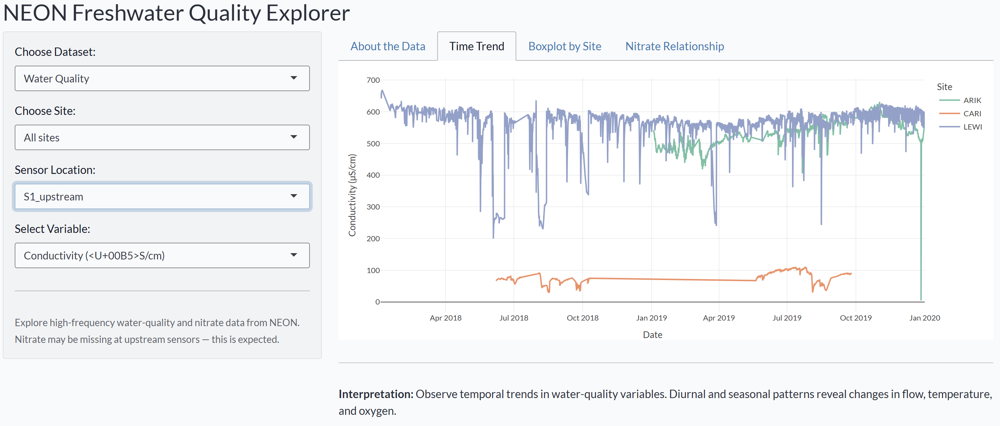

<!-- README.md is generated from README.Rmd. Please edit that file -->

# assign4nspack

<!-- badges: start -->

<!-- badges: end -->

## Introduction

**assign4nspack** is a teaching-focused R package for exploring
**high-frequency freshwater water-quality and nitrate relationships**
using data derived from the **National Ecological Observatory Network
(NEON)**.

It provides:

- Cleaned, curated hourly datasets (`wq_hourly`, `nitrate_hourly`,
  `wq_nitrate`)
- Data-processing scripts in `data-raw/`
- An interactive **Shiny app** to visualise water-quality and nitrate
  trends across sites  
- Full documentation and reproducible examples built with **roxygen2**
  and **pkgdown**

## Installation

You can install the development version of assign4nspack from
[GitHub](https://github.com/ETC5523-2025/assignment-4-packages-and-shiny-apps-NutchanokS)
with:

``` r
# install.packages("pak")
pak::pak("ETC5523-2025/assignment-4-packages-and-shiny-apps-NutchanokS")
```

Then load the package:

``` r
library(assign4nspack)
```

## Datasets Included

The package ships with three tidy datasets prepared from NEON sensor
data:

| Dataset | Description |
|----|----|
| **`wq_hourly`** | Hourly water-quality data (conductivity, dissolved oxygen, turbidity) from NEON **DP1.20288.001** |
| **`nitrate_hourly`** | Hourly nitrate concentrations (µmol/L) from NEON **DP1.20033.001** |
| **`wq_nitrate`** | Combined dataset aligning water-quality and nitrate observations by site, sensor, and timestamp |

## NEON Sites Included

This package includes three NEON freshwater stream sites used in
*Kermorvant et al. (2023)*:

| Site code | Full name | Location | Description |
|----|----|----|----|
| **ARIK** | Arikaree River | Colorado, USA | A semi-arid stream draining short-grass prairie and agricultural areas. Shows strong diel temperature and conductivity cycles and low nitrate variability. |
| **CARI** | Caribou Creek | Alaska, USA | A cold sub-arctic catchment with limited human influence. Low conductivity and nitrate due to pristine tundra landscape. |
| **LEWI** | Lewis Run | Pennsylvania, USA | A temperate, urban–agricultural watershed with elevated nitrate and conductivity from runoff and land use. |

These sites provide contrasting hydrological and biogeochemical regimes
— ideal for exploring how water-quality variables relate to nitrate
concentrations.

### Data filtering and coverage

Data were sourced from NEON freshwater sites covering the period
**January 2018 to December 2019**.  
For each site, both upstream (`S1_upstream`) and downstream
(`S2_downstream`) sensors were used when available.  
Raw 15-minute observations from NEON products DP1.20288.001 (Water
Quality) and DP1.20033.001 (Nitrate)  
were aggregated to **hourly means**, quality-filtered (`QF == 0`), and
merged by `site`, `sensor`, and `date_time`.

The final datasets include hourly records for **multiple NEON stream
sites** consistent with  
the study period described in *Kermorvant et al. (2023):*  
\> *“Understanding links between water-quality variables and nitrate
concentration in freshwater streams using high-frequency sensor data.”*

This ensures the datasets reflect comparable temporal coverage and data
quality to the published analysis.

### Example preview

``` r
library(dplyr)
data("wq_nitrate", package = "assign4nspack")
glimpse(wq_nitrate)
#> Rows: 62,139
#> Columns: 7
#> $ site          <chr> "ARIK", "ARIK", "ARIK", "ARIK", "ARIK", "ARIK", "ARIK", "ARIK", "ARIK",~
#> $ sensor        <chr> "S1_upstream", "S1_upstream", "S1_upstream", "S1_upstream", "S1_upstrea~
#> $ date_time     <dttm> 2019-01-03 16:00:00, 2019-01-03 17:00:00, 2019-01-03 18:00:00, 2019-01~
#> $ cond_uScm     <dbl> 542.3400, 540.3288, 537.1060, 535.5428, 535.4665, 536.3322, 537.7798, 5~
#> $ do_mgL        <dbl> 8.442500, 8.558167, 8.781667, 8.959333, 9.091833, 9.145000, 9.124500, 9~
#> $ turb_FNU      <dbl> 0.8062500, 0.7151667, 0.6653333, 0.6310000, 0.6008333, 0.5710000, 0.554~
#> $ nitrate_umolL <dbl> NaN, NaN, NaN, NaN, NaN, NaN, NaN, NaN, NaN, NaN, NaN, NaN, NaN, NaN, N~
```

## Key variables

- `site` — 4-letter NEON site identifier (e.g., ARIK, LEWI)
- `sensor` — sensor position (S1_upstream, S2_downstream)
- `date_time` — hourly timestamp (UTC)
- `cond_uScm`, `do_mgL`, `turb_FNU` — water-quality variables
- `nitrate_umolL` — nitrate concentration (µmol/L)

## Shiny App

The package includes an interactive Shiny dashboard to explore how
nitrate concentrations relate to water-quality measures across NEON
sites.

Launch it with:

``` r
assign4nspack::run_app()
```

### App overview

| Tab | Purpose |
|----|----|
| **About the Data** | Explains NEON products, variable meanings, and interpretation guidance |
| **Time Trend** | Line plots showing changes in conductivity, oxygen, turbidity, or nitrate over time |
| **Boxplot by Site** | Compare distributions across sites |
| **Nitrate Relationship** | Explore nitrate vs. water-quality variables with optional LM/LOESS fits, correlation, and site facets |

## Example Shiny App Screenshots

The following examples show key tabs from the **NEON Freshwater Quality
Explorer** included in this package.

**1. Time Trend:**  
Changes in water-quality variables (e.g., conductivity) over time for
all sites. 

**2. Boxplot by Site:**  
Distribution of conductivity across NEON sites. 

**3. Nitrate Relationship:**  
Nitrate vs. conductivity with both **Linear (orange)** and **LOESS
(black dashed)** fits. 

## Data Sources

All datasets are derived from publicly available NEON sensor products:

- **DP1.20288.001** — Aquatic Instrumentation: Water Quality (WQ)
- **DP1.20033.001** — Aquatic Instrumentation: Nitrate in Surface Water
  (NSW)

Data were aggregated to hourly resolution, quality-checked, and merged
by site and sensor. Used here solely for educational purposes in ETC5523
— Communicating with Data.

## Documentation & Website

**Package site:**
<https://etc5523-2025.github.io/assignment-4-packages-and-shiny-apps-NutchanokS/>

## License

This package is released under the **MIT License.** See the included
`LICENSE` file for details.

## Author

Nutchanok Saitin (Author & Maintainer)

## Acknowledgements

- Package infrastructure: `usethis`, `devtools`, `roxygen2`, `pkgdown`
- Data wrangling: `dplyr`, `tidyr`, `lubridate`, `purrr`
- Visualisation: `ggplot2`, `plotly`, `shiny`, `bslib`
- Original data source: *National Ecological Observatory Network (NEON)*

NEON (National Ecological Observatory Network). Water quality
(DP1.20288.001), RELEASE-2025. <https://doi.org/10.48443/03mj-t174>.
Dataset accessed from
<https://data.neonscience.org/data-products/DP1.20288.001/RELEASE-2025>
on October 28, 2025.

NEON (National Ecological Observatory Network). Nitrate in surface water
(DP1.20033.001), RELEASE-2025. <https://doi.org/10.48443/wwa3-p420>.
Dataset accessed from
<https://data.neonscience.org/data-products/DP1.20033.001/RELEASE-2025>
on October 28, 2025.
